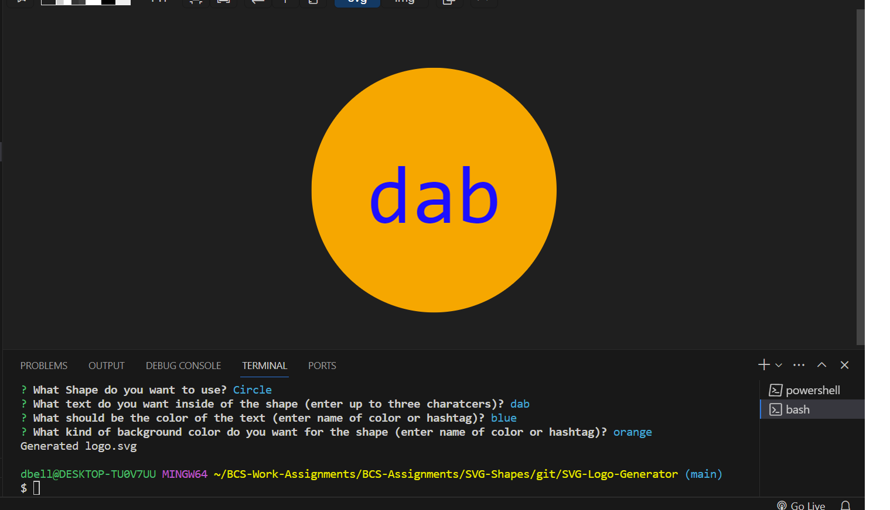

# SVG-Logo-Generator

##Description

This is an SVG logo generator. A user will be prompted with questions once they run nod.js in their console. They will be asked for a shape, text for the shape, text color, and shape color to produce their own SVG logo. User may also run test on the application to make sure everything runs correctly with jest.

To access, copy the repository in github, then use the git clone function in command line to clone this repository into your local machine.

##Usage

Link below:

https://github.com/devbelle/SVG-Logo-Generator

##Credits

All commits and changes to this assignment were implemented by Devin Belle

##License 

N/A

##Features

This Logo Generator include inquirer vers 8.2.4 for the question prompts and requires the user to have Node.js installed. Application also uses jest to test the files.

##Tests

Run npm test on the test file. Then run Node.js to receive the message prompts. 
